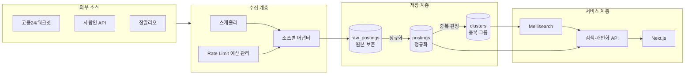

# job-radar

> 흩어진 채용공고를 한 곳에 모으고, **중복을 걷어내고**, 지원 상태까지 추적하는 개인용 채용 검색 서비스


---

## 왜 만들었나

이직을 준비하면서 매일 겪던 불편에서 출발했습니다.

| 문제 | 해결 |
|------|------|
| 사이트마다 로그인하고 검색 조건을 다시 입력해야 한다 | 통합 검색 + 저장된 검색 조건 |
| **같은 공고가 사이트마다 또 보인다** | **공고 중복 판정·통합** |
| 이미 본 공고인지 기억이 안 난다 | 읽음 처리 |
| 어디에 지원했는지 관리가 안 된다 | 지원 상태 파이프라인 |
| 마감일을 놓친다 | D-day 표시 / 마감 임박 알림 |
| 매일 직접 들어가서 확인해야 한다 | 조건 매칭 신규 공고 알림 |

## "또 하나의 채용 통합검색"과 다른 점

채용 통합검색은 흔한 주제입니다. 대부분은 `수집 → 목록 → 키워드 검색`에서 끝나고, 그건 위 표의 첫 번째 문제만 해결합니다.

job-radar가 실제로 푸는 문제는 **두 번째**입니다.

워크넷에 올라온 공고가 사람인에도, 원티드에도 올라옵니다. 검색 결과를 모아놓기만 하면 같은 공고를 세 번 보게 되고, 사이트를 돌아다니던 것과 달라지는 게 없습니다. **여러 소스의 공고를 하나로 묶는 것**이 이 프로젝트의 핵심이자 가장 어려운 부분입니다.

그리고 최종 목표는 **이 서비스에조차 매일 들어오지 않는 것**입니다. 저장한 조건에 맞는 신규 공고가 올라오면 알림이 오고, 그때만 확인하면 됩니다.

---

## 주요 기능

### MVP (개발 중)

**데이터 파이프라인**
- [ ] 다중 소스 자동 수집 (소스별 어댑터 + 스케줄러)
- [ ] 원본 보존 + 정규화 2단 저장 — 정규화 로직 수정 시 재수집 없이 재처리
- [ ] 통합 스키마 정규화 (지역·경력·고용형태·연봉 코드 통일)
- [ ] **공고 중복 판정 및 클러스터링**
- [ ] 마감 공고 자동 비활성화
- [ ] 소스 응답 스키마 변경 감지

**검색**
- [ ] 통합 키워드 검색 (한국어 형태소 + 동의어 사전)
- [ ] 필터 — 지역 / 경력 / 고용형태 / 기술스택 / 연봉 / 소스
- [ ] URL 기반 필터 상태 (공유 가능, 뒤로가기 정상 동작)
- [ ] 통합 상세 뷰 — 하나의 공고에 묶인 여러 소스 링크를 함께 노출
- [ ] 원문 링크 + 출처 표기

**이직 트래킹**
- [ ] 초대코드 기반 가입
- [ ] 관심 공고 북마크
- [ ] 지원 상태 파이프라인 (관심 → 지원 → 서류합격 → 면접 → 결과)
- [ ] 읽음 처리 / 마감 D-day

### 이후 계획

- [ ] 저장된 검색 조건 + 신규 공고 알림 (디스코드 웹훅 / 이메일)
- [ ] 제외 키워드 필터, 관심 기업 등록
- [ ] 공고 변경 이력 추적 (마감 연장·내용 수정 diff)
- [ ] LLM 기반 비정형 공고 본문 구조화 (요구경력·기술스택 추출)
- [ ] 중복 판정 피드백 루프
- [ ] 기술스택 트렌드 / 연봉 분포 통계

---

## 데이터 소스

공식 API로 제공되는 소스만 연동합니다.

| 소스 | 제공 형태 | 비고 |
|------|----------|------|
| 워크넷(고용24) 채용정보 | 공공데이터포털 | 공고량 최대, 본문 비정형. 출처 표기 의무 |
| 사람인 채용정보 API | 승인 후 access-key | 1일 500회 제한 |
| 공공기관 채용정보 (잡알리오) | 공공데이터포털 | 공공기관 채용공시 |
| 원티드 OpenAPI | 인증키 신청 | 연동 검토 중 |
| 로켓펀치 Open API | 앱 등록 | 연동 검토 중 |

### 크롤링을 쓰지 않은 이유

채용 데이터를 모으는 가장 쉬운 방법은 크롤링이지만, 이 프로젝트는 **크롤링 코드를 한 줄도 포함하지 않습니다.**

국내에 확정 판례가 있습니다. 사람인이 잡코리아의 채용정보를 무단 크롤링해 자사 서비스에 이용한 건에 대해, 서울고등법원은 저작권법상 **데이터베이스제작자의 권리 침해**를 인정했고 잡코리아가 최종 승소했습니다. 채용공고는 "공개된 정보"이지만 무단 수집·이용이 법적으로 제한되는 영역입니다.

그래서 잡코리아·LinkedIn·Indeed는 연동 대상에서 제외했습니다. 각각 개인 개발자에게 API를 제공하지 않거나(잡코리아 — 공공기관·학교 우선 제공, LinkedIn — 법인 파트너 전용), 공개 API 자체를 폐지했습니다(Indeed — Publisher API 2024년 종료).

**결과적으로 "모든 채용사이트 통합"은 불가능합니다.** 이 프로젝트는 합법적으로 접근 가능한 소스만 통합하며, 그 제약 안에서 최대한의 커버리지를 확보하는 것을 목표로 합니다.

### 데이터 이용 정책

- 비영리 개인 프로젝트이며 광고·유료화 등 수익화를 하지 않습니다
- 초대받은 소수 사용자만 이용하며, 불특정 다수에게 공개하지 않습니다
- 모든 공고는 **출처를 명시하고 원문 링크로 연결**합니다
- 수집 데이터를 제3자에게 제공하거나 재배포하지 않습니다
- 본 저장소는 채용 데이터를 포함하지 않습니다

---

## 기술 스택

| 레이어 | 선택 | 선택 이유 |
|--------|------|----------|
| Frontend | Next.js (App Router) | SSR 검색 결과 + URL 기반 필터 상태 관리 |
| Backend | NestJS | 수집 스케줄러가 상주해야 해 서버리스 단독으로는 부적합 |
| Database | PostgreSQL | `pg_trgm` 확장의 `similarity()`로 회사명·제목 유사도를 DB 레벨에서 계산 — **중복 판정에 직접 활용** |
| Search | Meilisearch | 한국어 토크나이징, 동의어 사전 설정 |
| Infra | Docker Compose | 단일 VPS 배포 |

---

## 아키텍처



### 설계 원칙

1. **원본은 덮어쓰지 않는다** — 정규화 로직에 버그가 생겨도 재수집 없이 재처리로 복구
2. **수집과 서빙을 분리한다** — 사용자 요청이 외부 API를 직접 호출하지 않는다
3. **소스 추가 비용은 어댑터 1개** — 정규화·중복판정·검색 계층은 소스를 모른다

---

## 핵심 기술 과제

### 공고 중복 판정

여러 소스의 같은 공고를 하나로 묶는 문제입니다. 정답이 정해져 있지 않아 규칙과 임계값을 계속 조정해야 합니다.

- **회사명 정규화** — `(주)` / `㈜` / `주식회사` / 영문·한글 혼용 / 띄어쓰기
- **제목 정규화** — `[신입/경력]`, `(재택가능)`, `★급구★` 등 장식 토큰 제거
- **판정** — 회사명 유사도 × 제목 유사도 × 마감일 근접도

판단이 어려운 사례들:

| 유형 | 사례 |
|------|------|
| 묶으면 안 되는데 비슷함 | 같은 회사의 `백엔드 개발자(신입)` vs `백엔드 개발자(경력)` |
| 묶어야 하는데 안 비슷함 | `(주)카카오` vs `Kakao Corp.` |

오탐(다른 공고를 합침)이 미탐(같은 공고를 못 합침)보다 치명적이므로, 임계값은 보수적으로 시작하고 사용자 신고를 통해 조정해 나갑니다.

### Rate Limit 예산 설계

사람인 API는 **1일 500회** 제한이 있습니다. 사용자 요청마다 외부 API를 호출하는 구조는 애초에 성립하지 않습니다.

- 키워드·직군별로 일일 호출 쿼터를 분배
- 마지막 수집 시각 이후 등록분 우선 (증분 수집)
- 잔여 쿼터 추적 및 소진 시 graceful degrade

### 한국어 검색

- 동의어 사전 — `프론트엔드 / FE / 프론트`, `백엔드 / 서버개발자 / BE`, `데브옵스 / DevOps / SRE`
- 기술스택 표기 정규화 — `node / nodejs / node.js`, `postgres / postgresql`
- 오타 허용 범위 튜닝

---

## 로드맵

| Phase | 내용 | 상태 |
|-------|------|------|
| 0 | API 키 확보 (사람인 승인 / 공공데이터포털) | 진행 중 |
| 1 | 수집 파이프라인 · 스키마 정규화 | 예정 |
| 2 | 중복 판정 · 검색 인덱스 | 예정 |
| 3 | 검색 UX | 예정 |
| 4 | 이직 트래킹 (MVP 완성) | 예정 |
| 5 | 신규 공고 알림 | 예정 |

---

## 로컬 실행

인프라(PostgreSQL·Meilisearch·Redis)는 바로 띄울 수 있다. 애플리케이션은 Phase 1에서 생성한다.

```bash
cp .env.example .env   # API 키 입력
pnpm infra:up          # 인프라 기동
pnpm probe alio        # 오픈API 응답 구조 확인
```

전체 절차와 API 키 발급 방법은 [docs/setup.md](docs/setup.md) 참고.

---

## 문서

| 문서 | 내용 |
|------|------|
| [architecture.md](docs/architecture.md) | 시스템 구성, 스택, 모듈 계획, 현재 진행 상태 |
| [erd.md](docs/erd.md) | 데이터 모델 초안과 설계 근거 |
| [api.md](docs/api.md) | API 명세 |
| [data-sources.md](docs/data-sources.md) | **소스별 응답 구조 실측 분석과 정규화 설계 결정** |
| [setup.md](docs/setup.md) | 개발 환경 준비, API 키 발급 절차 |

---

## 라이선스

- 코드: MIT
- 수집한 채용 데이터: 각 제공처의 이용약관을 따르며, 본 저장소에는 포함되지 않습니다
