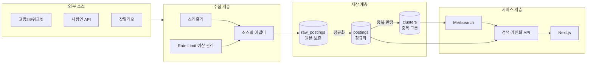

# job-radar — Architecture

## Overview

공식 API만 연동하는 채용공고 통합검색 서비스. 여러 소스의 공고를 수집·정규화하고, 중복 등록된 동일 공고를 하나로 묶어 검색·지원 상태 추적까지 제공한다.

## 현재 상태 (2026-09-12)

| 영역 | 상태 |
| --- | --- |
| 인프라 (Docker Compose) | 구성 완료 |
| 데이터 소스 — 잡알리오 | 키 발급·응답 구조 분석 완료 |
| 데이터 소스 — 워크넷(고용24) | 활용신청 대기 (시스템 점검 중) |
| 데이터 소스 — 사람인 | 이용신청 전 |
| DB 스키마 | 설계 초안 ([erd.md](erd.md)) |
| Backend | 미구현 |
| Frontend | 미구현 |

## Stack

| Layer | Tech | 상태 |
| --- | --- | --- |
| Frontend | Next.js (App Router), React, TypeScript | 미구현 |
| Backend | NestJS, TypeScript | 미구현 |
| ORM | 미정 (Prisma 검토) | 미정 |
| DB | PostgreSQL 16 + `pg_trgm`, `unaccent` | 컨테이너 구성 완료 |
| Search | Meilisearch v1.11 | 컨테이너 구성 완료 |
| Cache / Queue | Redis 7 | 컨테이너 구성 완료 |
| 수집 | 소스별 어댑터 + 스케줄러 | 미구현 |
| Infra | Docker Compose (단일 VPS 배포 예정) | 로컬 구성 완료 |

`pg_trgm`은 회사명·공고제목 유사도 계산에 직접 사용한다. PostgreSQL을 선택한 실질적인 이유다.

## Ports

| Service | Port |
| --- | --- |
| Frontend | 3001 |
| Backend | 8001 |
| PostgreSQL | 5432 |
| Meilisearch | 7700 |
| Redis | 6379 |

doc-nexus가 3000/8000을 사용하므로 두 프로젝트를 동시에 띄울 수 있도록 3001/8001을 쓴다.

## 구성



## 설계 원칙

1. **원본은 덮어쓰지 않는다** — 정규화 로직에 버그가 생겨도 재수집 없이 재처리로 복구한다
2. **수집과 서빙을 분리한다** — 사용자 요청이 외부 API를 직접 호출하지 않는다. 사람인 API의 1일 500회 제한상 실시간 프록시는 애초에 성립하지 않는다
3. **소스 추가 비용은 어댑터 1개** — 정규화·중복판정·검색 계층은 어떤 소스에서 왔는지 모른다

## 백엔드 모듈 (계획)

| 모듈 | 역할 | 상태 |
| --- | --- | --- |
| collector | 소스별 수집 어댑터, 스케줄러, 호출 쿼터 관리 | 미구현 |
| normalizer | 원본 응답 → 통합 도메인 모델 변환, 코드 매핑 | 미구현 |
| dedup | 회사 확정(1단계) + 공고 중복 판정(2단계) | 미구현 |
| search | Meilisearch 색인·질의, 동의어 사전 | 미구현 |
| posting | 공고 조회·상세 | 미구현 |
| bookmark | 관심 공고, 지원 상태, 읽음 처리 | 미구현 |
| auth | 초대코드 가입, 세션 | 미구현 |
| notification | 저장된 검색 조건 매칭 신규 공고 알림 | 미구현 |

## 저장소 구조

```text
job-radar/
├── backend/              # 미생성 — Phase 1에서 nest new
├── frontend/             # 미생성 — Phase 1에서 create-next-app
├── docker/
│   └── postgres/init/    # 컨테이너 최초 기동 시 확장 설치
├── docs/
│   ├── architecture.md   # 이 문서
│   ├── erd.md            # 데이터 모델
│   ├── api.md            # API 명세
│   ├── data-sources.md   # 소스별 응답 구조 분석 및 정규화 설계 결정
│   └── setup.md          # 개발 환경 준비
├── scripts/
│   └── probe.mjs         # 오픈API 응답 구조 확인용
└── docker-compose.yml
```

## 관련 문서

- [erd.md](erd.md) — 데이터 모델
- [api.md](api.md) — API 명세
- [data-sources.md](data-sources.md) — 소스별 응답 구조와 정규화 설계 결정
- [setup.md](setup.md) — 개발 환경 준비, API 키 발급
